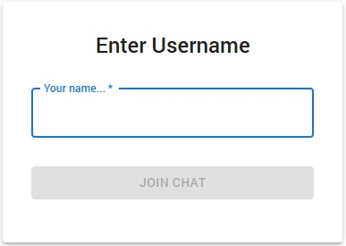
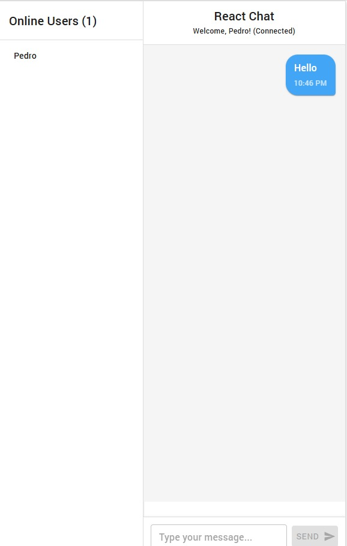
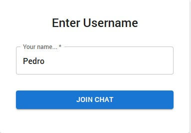
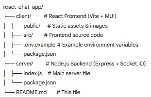

# React Real-Time Chat Application

[](https://opensource.org/licenses/MIT)

A full-stack, real-time chat application built with React (using Material UI), Node.js, Express, and Socket.IO. Enables live communication with features like persistent usernames, online user lists, and typing indicators within a modern user interface.

## Screenshots

| Username Entry                     | Chat Interface                       |
| :--------------------------------- | :----------------------------------- |
|  <br/> _User is prompted to enter a username._ |  <br/> _Main chat view showing messages._ |
|  <br/> _User typing their username._     |                                      |

**Directory Structure:**



_Overview of the project folder structure._


## Key Features

* **Real-Time Messaging:** Instant message delivery via WebSockets (Socket.IO).
* **Usernames:** Users select a username for their session identification.
* **Online User List:** Live display of currently connected users.
* **Typing Indicator:** Shows when other users are actively typing.
* **Message Timestamps:** Displays the time each message was sent.
* **Own Message Differentiation:** Visually distinguishes user's own messages (alignment and color).
* **Modern UI:** Interface built with the Material UI (MUI) component library.

## Tech Stack

* **Frontend:**
    * React (v18+)
    * Vite (Build Tool)
    * Material UI (MUI) v5
    * Socket.IO Client
    * CSS3 / Emotion (for MUI styling)
* **Backend:**
    * Node.js (v18.x or later recommended)
    * Express
    * Socket.IO
    * CORS
* **Development:**
    * ESLint
    * Nodemon (optional, for server development)

## Project Structure

The project follows a monorepo-like structure with separate client and server directories located at the root.

* `client/`: Contains the React frontend application (Vite + MUI).
    * `public/`: Static assets, including images for this README.
    * `src/`: Frontend source code (components, hooks, etc.).
    * `.env.example`: Example environment variables for the client.
* `server/`: Contains the Node.js backend application (Express + Socket.IO).
    * `index.js`: Main server entry point.

## Prerequisites

Before you begin, ensure you have the following installed globally:

* [Node.js](https://nodejs.org/) (v18.x or later recommended)
* [npm](https://www.npmjs.com/) (v9.x or later) or [yarn](https://yarnpkg.com/)

## Getting Started

Follow these steps to set up the project locally:

1.  **Clone the repository:**
    ```bash
    git clone [https://github.com/Owono2001/react-chat-app.git](https://github.com/Owono2001/react-chat-app.git) # Replace with your repo URL
    cd react-chat-app
    ```

2.  **Install Server Dependencies:**
    ```bash
    cd server
    npm install
    # or: yarn install
    cd .. # Go back to the root directory
    ```

3.  **Install Client Dependencies:**
    ```bash
    cd client
    npm install
    # or: yarn install
    cd .. # Go back to the root directory
    ```

4.  **Set Up Client Environment Variables:**
    * Navigate to the `client` directory:
        ```bash
        cd client
        ```
    * Create a `.env` file from the example:
        ```bash
        cp .env.example .env
        ```
        *(If `cp` doesn't work, manually copy `.env.example` to `.env`)*
    * Ensure `.env` contains the correct backend URL for local use:
        ```env
        # client/.env
        VITE_SERVER_URL=http://localhost:3001
        ```
    * Navigate back to the root directory:
        ```bash
        cd ..
        ```

## Running Locally - Step-by-Step

This application requires **two** separate processes running simultaneously: the backend server and the frontend client. You will need **two terminal windows/tabs** open, both starting from the project's root directory (`react-chat-app/`).

**➡️ Terminal 1: Start the Backend Server**

1.  Open your first terminal window in the project root (`react-chat-app/`).
2.  Navigate to the `server` directory:
    ```bash
    cd server
    ```
3.  Start the Node.js server:
    ```bash
    npm start
    ```
    *(Or use `npm run dev` if configured with nodemon)*
4.  Expect output similar to:
    ```
    [nodemon] starting `node index.js`
    Server listening on *:3001
    ```
5.  **Leave this terminal running.**

**➡️ Terminal 2: Start the Frontend Client**

1.  Open a **second** terminal window in the project root (`react-chat-app/`).
2.  Navigate to the `client` directory:
    ```bash
    cd client
    ```
3.  Start the Vite development server:
    ```bash
    npm run dev
    ```
4.  Expect output similar to:
    ```
      VITE vX.Y.Z  ready in XXX ms

      ➜  Local:   http://localhost:5173/
      ➜  Network: use --host to expose
    ```
5.  **Leave this terminal running.**

**➡️ Accessing the Application**

1.  Open your web browser.
2.  Navigate to the **Local URL** from Terminal 2 (usually `http://localhost:5173/`).
3.  The application should load, showing the username prompt.

## Deployment

Deploying this application requires hosting two components separately:

1.  **Backend:** Deploy the `server/` directory to a Node.js hosting service supporting WebSockets (e.g., Render Web Service, Railway).
2.  **Frontend:** Build the `client/` directory (`npm run build`) and deploy the output folder (`client/dist/`) to a static hosting service (e.g., Render Static Site, Vercel, Netlify).

**Configuration:** Set the `VITE_SERVER_URL` environment variable in the frontend's build environment to the public URL of your deployed backend. Also, configure the backend's CORS settings (`server/index.js`) to allow requests *only* from your deployed frontend's URL.

* **[Link to Live Demo]** *(Optional: Add link if deployed)*

## Contributing

Contributions are welcome! Please open an issue to discuss changes or submit a pull request.

1.  Fork the Project.
2.  Create your Feature Branch (`git checkout -b feature/AmazingFeature`).
3.  Commit your Changes (`git commit -m 'Add some AmazingFeature'`).
4.  Push to the Branch (`git push origin feature/AmazingFeature`).
5.  Open a Pull Request.

Please try to follow the existing code style and conventions.

## License

Distributed under the MIT License. See `LICENSE` file for more information. (You should create a `LICENSE` file containing the MIT license text).

## Contact

Pedro Owono - [@Owono2001](https://github.com/Owono2001) - owonoondomangue@gmail.com
